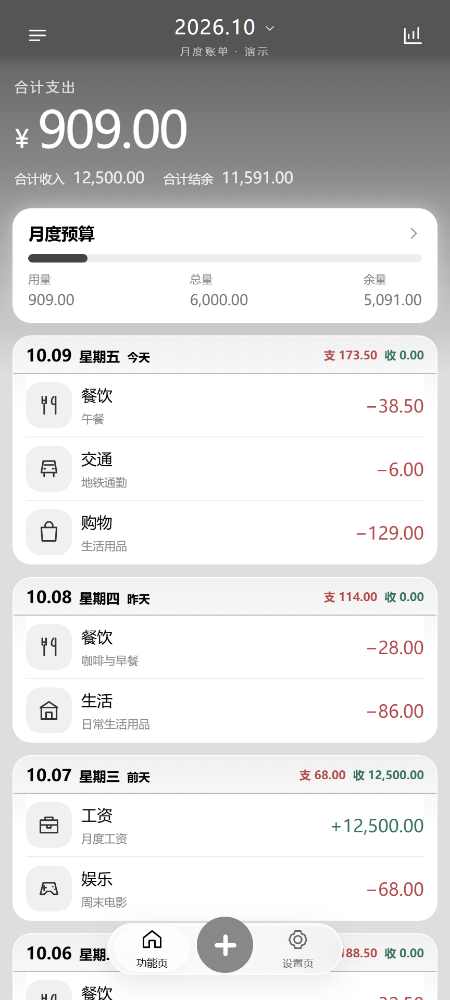
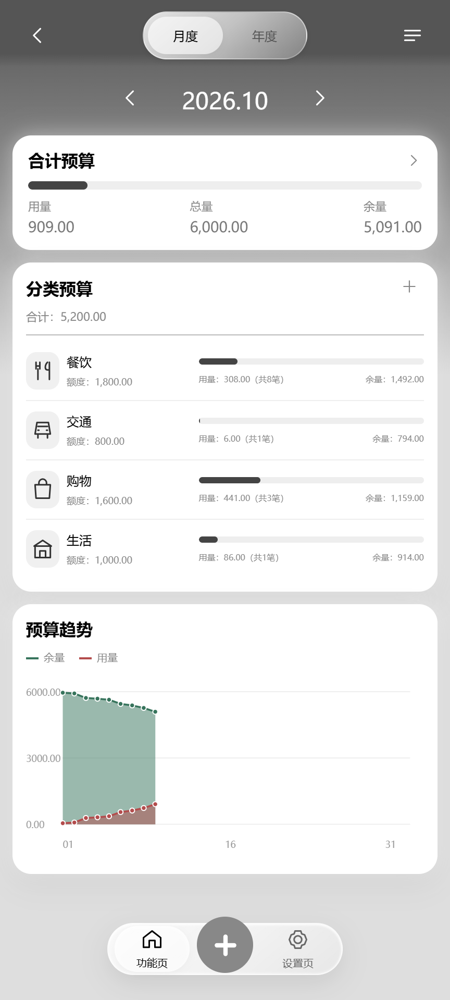
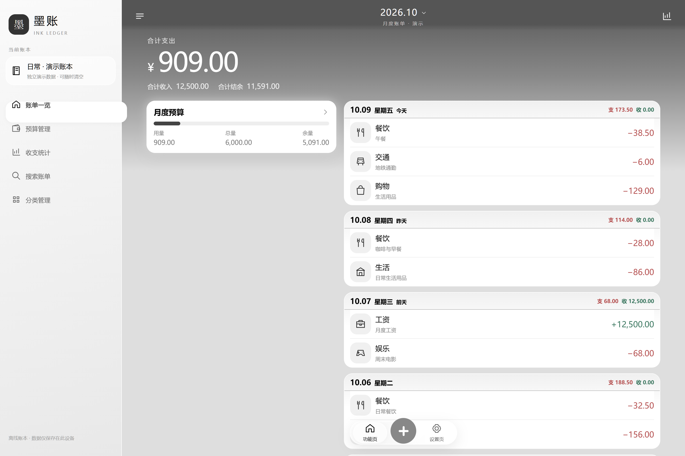
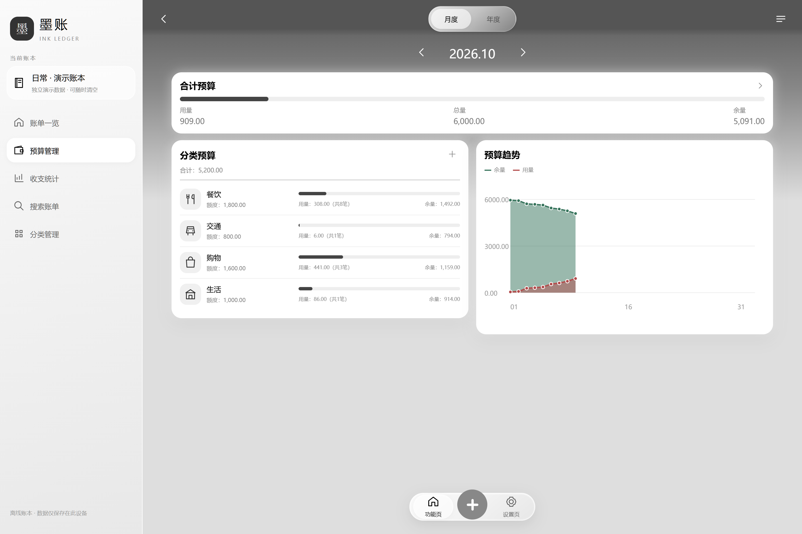

# 墨账 · Android 0.1.18-webview

这是可安装的离线记账第一版，采用 Java Android Activity + 本地 WebView 界面。界面资产直接随 APK 打包，不连接网站、不申请网络权限。**不是 Jetpack Compose 或鸿蒙原生组件实现**。

## 界面预览

截图使用演示账单，来自浏览器运行同一套本地界面。

| 手机账单一览 | 手机预算管理 |
| --- | --- |
|  |  |





## 安装与运行

安装交付的 `墨账-0.1.18-webview-debug.apk`，支持 Android 8.0 及以上。请使用更新后的 Android System WebView / Chrome（建议 110 及以上），以支持背景模糊、动态视口和无障碍属性。

初次启动可选择“开始记账”或“体验演示”。演示数据有明确标识，设置中可确认清空并切换到空白账本。此操作会清空演示期间写入的全部数据，建议先导出。

## 已实现

- 多账本创建、切换；收入／支出新增、编辑、日期与时间、备注；分类管理与快速改分类。
- 按月／年查看、按天聚合、按分类统计、按分类／备注／金额搜索。
- 手机抽屉菜单；宽度达到 840 CSS 像素时默认固定侧栏；旋转或窗口尺寸变化时自动切换。平板完整显示使用自身布局，不依赖平行视界。
- 固定按钮与点击区域宽度、主区域居中的浮动底栏；三档光感材质与 API 不支持模糊时的半透明遮罩降级。
- 日期栏点击预填该日当前时间；日期栏左滑后单击移入回收站整天；账单图标快速改分类；其余区域打开半屏详情；长按账单在按压位置显示编辑／删除／多选菜单、长按日期打开记账。
- 整天和单笔删除均移入回收站；整个条目／日期卡片范围生成粒子，逐渐替代原卡片后向外扩散；支持减少动态效果系统偏好。
- 触摸滚动边界的阻尼与弹簧回弹。桌面鼠标滚轮没有触摸回弹。
- 月度／年度合计预算与独立分类预算；累计用量、余量、笔数；每日实际记录形成趋势。月度绘制点与线，年度绘制连续线；红绿区域填充透明度 50%。未来日期不绘制。
- 本地原子文件保存，金额按整数分存储；输入最多两位小数，金额统一显示两位小数。
- 完整 JSON 导出／导入，Android 使用系统文件选择器；格式检查、替换确认；回收站恢复与确认永久删除。

## 构建

推荐 Android Studio 导入该文件夹，JDK 17 或以上、Android SDK 35、AGP 8.7.3、Gradle 8.11.1；无第三方 Android 依赖。

Windows 上也可使用随附的独立构建脚本（JDK 21 和 SDK build-tools 35.0.0 已验证）：

```powershell
.\build-local.ps1 -SdkPath '你的Android SDK路径' -JdkPath '你的JDK路径'
```

脚本使用官方 aapt2、javac、d8、zipalign 与 apksigner，生成本地调试密钥和调试签名 APK。**调试签名适合预览和开发，不是应用商店正式发布签名**。在新的环境构建会生成不同密钥，升级安装需保留原密钥或先导出数据。

## 验证范围

APK 已实际编译并通过 v2/v3 签名校验。浏览器界面验证覆盖主要记账、恢复、预算、布局和金额精度路径，见 `docs/verification.json`。截图来自 Chrome 运行相同本地界面，手机 432×960（20:9）、平板 1440×960（3:2）。没有 Android 真机或模拟器上的运行验证；系统文件选择器、键盘、实际 GPU 性能和低版本 WebView 仍需设备测试。

界面验证脚本随源码保存在 `tools/verify.cjs`。安装 Node.js 后执行 `npm install`、`npx playwright install chromium`、`npm test` 即可重新验证；截图与报告写入 `test-results/`，亦可通过环境变量 `CHROME_PATH` 指定本机 Chrome。

## 当前数据约定

币种为人民币，预算仅计算支出，不把收入抵扣支出；余量允许负数；预算进度条封顶为 100%。每个账本各自独立设置每月／每年的预算，分类预算合计不自动修改合计预算。年度查看主页月度预算时，暂取所选年份的当前月份。删除账单后当前统计和历史累计趋势都会重新计算。

回收站入口仅在设置页内。留存期限暂为“不自动清理”，需手动恢复或永久删除；仅显示当前账本的删除记录。卸载会移除应用私有数据，正式使用前请定期导出备份。

账号、云同步、支付账户余额、转账、退款、自动记账、导入其他软件格式、多人共享、附件与加密均未接入。后续需求见 `docs/待补充需求.md`。

## 视觉参考

- [华为沉浸光感官方说明](https://consumer.huawei.com/cn/support/content/zh-cn16090851/)：通透光影、强／均衡／弱三档。
- [HarmonyOS 7 官方介绍](https://consumer.huawei.com/cn/harmonyos-7/)：光感粒子、光随指动和空间卡片。
- [华为设计指南](https://developer.huawei.com/consumer/cn/design)：材质、互动区域与自适应界面。
- [钱迹官网](https://www.qianjiapp.com/)及[用户指南](https://docs.qianjiapp.com/)：便捷记账、多账本与统计。

参考上述官方描述进行 Android 近似表达，不代表复刻系统内部渲染技术。

## 0.1.1 界面调整

卡片内边距由 20–24 px 缩至 12–14 px，模块间距由 20 px 缩至 12 px，账单行高由 76 px 缩至 60 px；收紧顶部汇总、侧边栏、预算分类、设置与弹层。主要导航和记账图标保留原有点击面积。使用原调试密钥签名，可覆盖安装上一版，保留原账本。

## 0.1.2 底栏位置

居中时按钮顺序为“主页、记一笔、设置”。设置中的“平板底栏位置”可选择左下、居中、右下，相对主内容区域定位；左下顺序为“记一笔、主页、设置”，右下顺序为“主页、设置、记一笔”。手机始终居中，进入平板布局时恢复已保存的偏好。旧数据和旧备份缺少该设置时自动使用居中；底栏宽度和按钮点击面积保持固定。

## 0.1.3 删除与页面过渡

单笔和整天移入回收站均单击执行，不弹确认；回收站内永久删除继续确认。手势点击抑制限于原手势元素，并在下一次按下及手势取消时清理，避免长按或滑动后吞掉下一次点击。

移除页面文学性标题、副标题、侧栏标语、空状态及备注占位文案。月度／年度顶栏使用窄边缘光，左下与右上最亮，向相邻边缘渐弱。

页面按侧栏“账单、预算、统计、搜索、分类、回收站”的顺序决定上／下移入；旧页模糊淡出，新页移入并由模糊变清晰。相邻菜单约 400 ms，跨两项约 355 ms，跨更多项进一步缩短至最低 240 ms，并增加位移，使用加速后减速曲线。侧栏与底栏保持可操作，连续导航会清理旧动画；系统减少动态效果时直接切换。

## 来源展开与多选

侧栏跨项切换按间隔数增加位移：一格 104 px / 430 ms，两格 208 px / 400 ms，跨更远位移继续增大、时长逐步缩短至最低 260 ms。账单主页点击预算卡片从原矩形展开到主显示区域（480 ms），同时模糊渐变、淡入淡出，起步最快并非线性减速至停止。底栏记一笔保留原圆形展开（460 ms）；其它二级弹层顶部从显示区域底边起步，以 440 ms 非线性减速移入。平板侧栏不参与功能页弹层的展开与遮罩。减少动态效果时直接打开。

长按账单在按压位置显示三项菜单：编辑、删除、多选。菜单靠近屏幕边缘时自动调整位置，保持在主显示区域内。单击账单仍显示详情，单击分类图标仍快速改分类。

多选可跨日期选择，点击行／图标勾选或取消，点击日期选择／取消整日；底部提供当前列表全选／全不选、批量改分类、批量删除、取消。批量分类要求所选账单属于同一收支类型，以保持分类与收支一致；批量删除直接移入回收站，无再次确认，并使用多条目粒子效果。搜索全选只包含当前筛选结果，导航离开当前页会退出多选，系统返回／Escape 也可取消。单笔与批量删除均可在回收站恢复，永久删除继续确认。


## 0.1.5 界面与导航调整

底栏入口改为功能页／记一笔／设置页。设置仅保留底栏入口，从右侧横向模糊渐变进入，并收起侧栏占满屏幕；返回功能页恢复此前板块、预算周期及滚动位置，平板自动恢复侧栏。底栏与按钮选中框均为药丸形，外框高度缩至 50 px，加号保持 54 px 并突出顶边；侧栏和底栏选中框以 360 ms 动画移动，底栏选中框位于加号下层。

日期行高度 36 px，日期／星期／今昨前字号为 16／13／11 px。未设置合计预算时，总量和余量用与已支出整数位数相同数量的短横线占位；不显示未设置预算提示，不画趋势图，显示“暂未设置合计预算”。分类空状态显示“暂未设置分类预算”。预算顶栏仅保留窄药丸形光边，移除图表底部解释文案。

此次通过 40 项浏览器界面与交互检查；安装包已构建并通过签名校验，尚未进行 Android 实机测试。


## 0.1.6 动画性能修复

原页面切换逐帧改变全屏 Gaussian blur。现在使用固定模糊图层与清晰图层交叉淡化；模糊计算位于内部固定图层，位移、透明度和预算展开裁剪在外层进行，避免把每帧变化的裁剪区域送入模糊计算。仅在动画期间为移动层添加 GPU 提示，结束或中断时移除副本并释放提示。移除整条账单内容长期使用的 will-change，预算展开不再创建一个未使用的账单列表副本。滚动背景变化按 requestAnimationFrame 合并，数值达到边界后不再反复写入相同背景属性。

Android 在动画、触摸及滚动期间请求当前分辨率下屏幕的最高可用刷新率；API 35+ 同时设置 WebView 的视图帧率请求。JavaScript 请求节流至最多每 250 ms 一次，最后一次交互 1.5 秒后重置为系统默认，在 Activity 暂停时立即重置。此请求尊重设备和系统决策，不能绕过省电、温控、厂商应用限帧或硬件性能限制。

43 项浏览器交互与动画结构检查通过，APK 构建和 v2/v3 签名校验通过。没有连接 Android 实机，未测得 Android GPU 呈现帧率，不能声明已稳定满 120 fps。桌面性能回调采样仅用于同环境对照，不代表实机呈现；之前的 GIF 预览录制为 30 fps，也不能用于验证安装包帧率。

参考：[Android 自适应刷新率](https://developer.android.com/develop/ui/views/animations/adaptive-refresh-rate)、[Chrome 模糊动画性能](https://developer.chrome.com/blog/animated-blur)。


## 0.1.7 保留连续高斯模糊，优化平板横向切换

用户在 HUAWEI MatePad Pro 13.2 英寸 2025 直接运行 APK 时反馈横向切换仍有掉帧，并要求恢复原来的高斯模糊观感。0.1.6 的固定模糊交叉淡化已撤回，现在直接连续改变 Gaussian blur 半径，保留原始 0–10／12 px 的变化、位移和透明度；没有通过降低模糊强度改善性能。

针对进入设置页／返回功能页：取消侧栏 margin-left 宽度动画，主显示区域在过渡开始前完成一次尺寸切换，避免与整页横向动画叠加并在每帧重排。旧页使用已有 DOM 移入临时视口，不再深度复制整个页面；侧栏和底栏复用导航按钮及选中标记。按下相关底栏按钮时提前准备合成图层，动画完成／中断后释放；屏外账单使用 content-visibility 避免参与当前绘制。动画滤镜限制在显示视口内。

高刷新率请求改为回到前台时提前发起，在前台保持可用的最高刷新率偏好，进入后台时恢复系统默认；旋转／窗口配置变化后重新计算。撤回上一版 1.5 秒无交互后释放刷新率的策略，以避免快速横向动画起步时仍在升频。系统仍决定最终刷新率。

44 项浏览器回归检查通过，包括动画中途连续高斯半径采样、DOM 复用与快速导航清理、设置返回尺寸检查。另通过 500 条账单的横向切换与图层准备清理检查。APK 构建与 v2/v3 签名通过。未获得该平板的实机呈现帧数据，不能据此认定掉帧已经消失，也不能将浏览器回调采样视作设备实际 FPS。


## 0.1.8 记账弹层：保持原展开效果，补收起与竖屏修复

按用户要求保留整张记账界面从加号圆形位置展开的原始表现：表单和背景共同缩放，圆角变化，460 ms，cubic-bezier(.4,0,.2,1)，背景高斯模糊保留。未使用“仅背景展开、表单单独渐显”的替代方案。

性能调整限定于合成图层提示、布局／样式隔离、固定表单列宽；展开完成后延后两个动画回调再聚焦输入框，避免键盘 resize 和展开结束同步启动。不以降低帧率、缩短动画或移除视觉效果掩盖卡顿。

用户关闭、点击遮罩、系统返回以及保存账单都会播放收起动画。由加号打开的记账弹层缩回当前加号位置，其它弹层向下退到屏幕外；在展开途中关闭会反向播放正在进行的展开，连续替换弹窗不会被旧回调误清除。系统减少动态效果时立即关闭。

竖屏弹层不超过主显示区域，日期／时间双列使用 minmax(0,1fr)，表单 input/select 明确限制宽度。通过 320、432、800、960、1440 CSS px 五种宽度的内容／控件边界检查，以及原始动画目标和曲线、保存与关闭、展开中反向关闭、替换关闭中的弹窗、减少动态效果检查。44 项浏览器回归通过，APK v2/v3 校验通过。当前没有该 MatePad 的 GPU 呈现帧数据，尚未证明展开掉帧已消失。


## 0.1.9 图样衔接与同步导航

按最新要求增加加号与记账界面的双向衔接：沿原来整个面板的中心轨迹叠加白色粗加号，展开起始 20% 进度内加号逐渐隐去、记账内容出现，同时圆形中灰底渐变为记账底色；收起最后 20% 进度反向衔接。原来的整张面板缩放、圆角和速度曲线保留，背景高斯模糊保留。没有改为独立背景展开的替代动画。

设置页切换时，侧栏用临时合成副本平滑滑出，返回功能页时真实侧栏滑入；两者使用和横向页面相同的 480 ms／cubic-bezier(.16,1,.3,1)。主显示区域仅在开始时确定尺寸，不通过每帧改宽度产生布局重排；结束或中断后移除副本并清理动画。

侧栏选中框使用与页面相同的时长、曲线和中间位移比例（50% 关键帧剩余位移 38%），跨多项时共同调整时长。快速切换会从选中框当前实际位置继续。通过 15%、50%、80% 三个时间点的归一化位移比对；底栏选中框也使用对应页面的切换时长。

回收站入口从侧栏移除，仅在设置页保留。回收站作为设置的子页全屏显示，左上角返回设置页；底栏设置页保持选中，功能页按钮仍恢复进入设置前的板块。移入回收站不确认，永久删除继续确认。

44 项浏览器回归通过，额外通过同步位移／时长、侧栏收缩和恢复、加号图样生命周期、回收站层级、快速中断、减少动态效果以及五种屏宽的记账弹层检查。APK v2/v3 签名通过。动画 GIF 是 30 fps 采样预览，不能当作 Android 实机帧率测量。


## 0.1.10 覆盖侧栏与底栏连续移动

功能页面底层铺满全屏，平板侧栏绝对定位覆盖在左侧；内容、弹层和粒子区域为侧栏预留空间，设置页释放该空间。侧栏不再参与横向布局，不会挤压全屏底层。手机继续采用覆盖式抽屉。

功能页和设置页切换时，底栏用当前可见位置到最终位置的合成变换移动，和页面保持相同的 480 ms 时长与速度曲线。左下、居中、右下位置均检查；右下因屏幕右边缘未改变而保持原位置。快速反向切换从动画中的实际位置继续，不跳回起点。原高斯模糊、记账展开和收起效果保留。

浏览器专项验证包含全屏底层、覆盖式侧栏、三种位置的连续位移及中途反向、弹层遮罩不影响平板侧栏、竖屏抽屉。APK v2/v3 签名通过。


## 0.1.11 统一起步最快的减速过渡

页面切换、侧栏与底栏、选中框、预算展开、记账双向缩放、普通弹层进出、左滑、提示和边界归位统一使用 cubic-bezier(.16,1,.3,1)。位移和缩放从最大速度开始，持续减速到零；页面移除中间位移节点，选中框和页面仍保持同步。位移距离、时长、圆角、颜色与高斯模糊效果保留。粒子铺满到发散的顺序保留，各阶段改为减速变化。

展开尚未结束时关闭，会采样当前变换和透明度，以同样的减速曲线正向启动关闭，避免反放减速动画变成加速，也避免跳回展开终点。边界归位采用同一减速曲线。

专项检查按 20 个时间间隔取样，验证速度单调下降、尾段趋于零；检查所有导航和弹层曲线、中途关闭位置连续、CSS 抽屉／左滑／提示／边界曲线以及原选中框同步、覆盖布局和五种屏宽。浏览器验证不能代替 Android 实机帧率测量。


## 0.1.12 保留视效的整体性能优化

复用 Intl.NumberFormat 和 SVG 图标字符串；账单按日分组、分类支出聚合和趋势每日累计改为单次扫描，移除反复筛选整份数据。批量删除使用 Set 判断所选标识符。页面更新先计算内容，批量测量选中框几何后写入；页面快照通过 Range 转移原 DOM 节点，保留节点身份和事件。

粒子的阶段进度和透明度每帧计算一次，画布透明度每帧设置一次，连续同色粒子跳过重复填充样式设置。粒子总数、半径、颜色、排列和绘制顺序不变。CSS、模糊半径、动画关键帧、时长和减速曲线保持原样。存储格式和原子写入流程保持原样。

同机桌面 Chrome 使用 8,000 笔年度账单，预热后 7 次采样中位数：主页 HTML 生成约 109.8 → 9.9 ms；预算约 88.0 → 0.7 ms；统计约 2.2 → 0.2 ms；搜索约 110.0 → 11.3 ms。这里衡量数据计算及内容字符串生成，不是页面总耗时或 Android 帧率。布局次数 16 → 16，样式重算 26 → 24。

优化前后生成的主页、预算、统计和搜索 HTML 完全一致；固定时间并同步暂停所有动画，13 个静态及动画抽样帧逐像素一致；固定随机种子，另外 3 个粒子帧逐像素一致。测试先预热 Windows Chrome 字体路径，避免首个上下文的文字栅格初始化差异。画面对照在增加显示版本号之前进行。性能原始采样和视觉结果见 docs/performance-comparison.json。

44 项交互回归及原有导航、弹层、减速、布局、500 笔账单切换专项通过；APK v2/v3 签名通过。尚未连接用户的 Android 平板测量 GPU 呈现帧率。


## 0.1.13 录屏停顿对应的动画执行优化

Chromium 跟踪记录显示，原来记账面板将 transform、backgroundColor、borderRadius 放在同一个动画中；四个圆角属性不支持合成线程动画，导致包含缩放和位移的整组动画退回主线程。现在仍使用同一个面板、同一套原始 editorShape 和完整内容缩放，将位移／缩放、底色、圆角分为三个同步执行的属性动画。没有拆成独立背景扩张和固定大小表单，也没有用固定模糊交叉淡化替代真实高斯半径变化。

记账编辑器从创建时就使用 origin-expand，避免先建立普通底部滑入再取消切换到圆形展开。展开中途关闭，分别采样各通道当前显示值，再沿原来的减速曲线收回；全部通道完成或取消后才清理面板。

设置和预算矩形展开时，旧 pageSurface 容器及子树整体保留为离场界面，不拆开其内容另建旧页面。新页面建立独立的活动容器；滚动和边界事件改为按当前 scroll 委托，避免替换容器后丢失行为。静止背景在弹层存在期间保留合成提示，弹层移除后释放。侧栏、预算、记账按钮按下时预热旧页面图层；动画中的背景依旧动态更新并参与原有高斯模糊。

桌面 Chromium 人为阻塞主线程 180 ms 的真实合成画面对照：0.1.12 面板在检测期间停留在 1 个位置，新版在同一负载阶段仍推进到多个不同位置。该测试验证几何动画可以独立于主线程推进，不代表用户平板已经实测满 120 fps。

11 个静态／侧栏／横向／预算展开抽样帧逐像素一致。记账展开两个抽样时刻的计算样式完全一致，包括位移、缩放、变换原点、底色、圆角、模糊、透明度、尺寸与阴影；切换为合成线程后边缘取样存在少量栅格差异，未宣称记账截图逐像素完全相同。CSS 文件与 0.1.12 完全相同。完整对照在版本标签更新前完成。

44 项交互回归及展开／收起／快速中断、五种屏宽、侧栏与页面同步、底栏连续移动、真实高斯模糊、减速曲线、500 笔账单切换和主线程阻塞专项通过。APK v2/v3 签名通过。可用 npm install --no-save playwright pngjs 后运行 tools/check-compositor-stall.cjs 重现人工阻塞对照；CHROME_PATH 可以指定 Chrome。测试夹具只包含 0.1.12 的应用资产，没有用户账单。

## 加号与页面的中段交接

展开和收起的图标、内容与底色交接集中在动画时间轴的 20%～50%。前后段保持图标或完整页面状态，整体形状、位移、缩放、模糊和减速曲线延续原版。动画中途关闭也从当前显示状态交接，不产生透明度跳变。

## 预算卡片按压与展开

账单一览的预算卡片按下时下压并缩小，预算页面从当前卡片范围展开，展开过程中原账单页面逐渐压暗至 40%，高斯模糊连续增加至 24px。预算页面本身保持清晰，圆角从原来的 18px 随扩展连续缩小至 0px；侧栏导航的高斯模糊保持原样。平板手动收起/展开侧栏时，侧栏和主显示区域使用相同的 300ms 减速曲线同步移动，底栏同步跟随。
