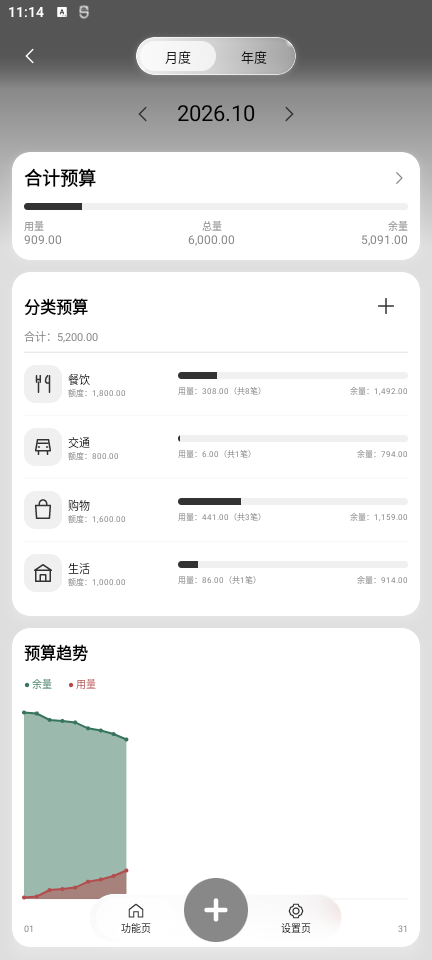
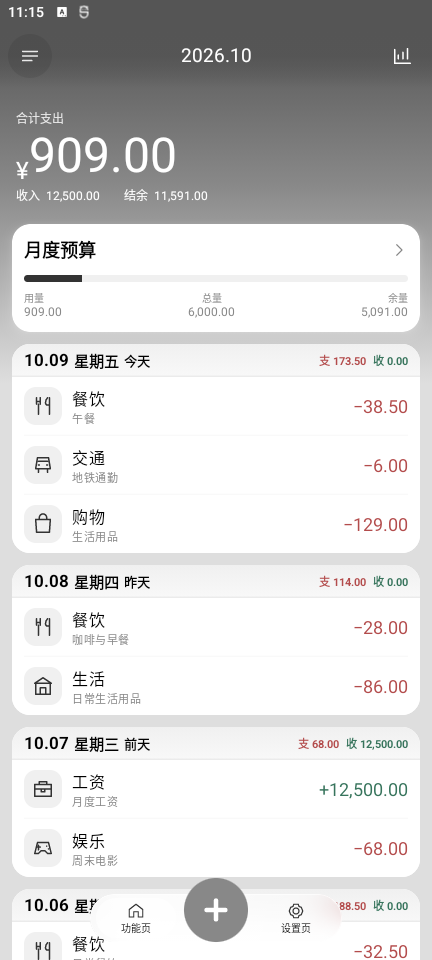
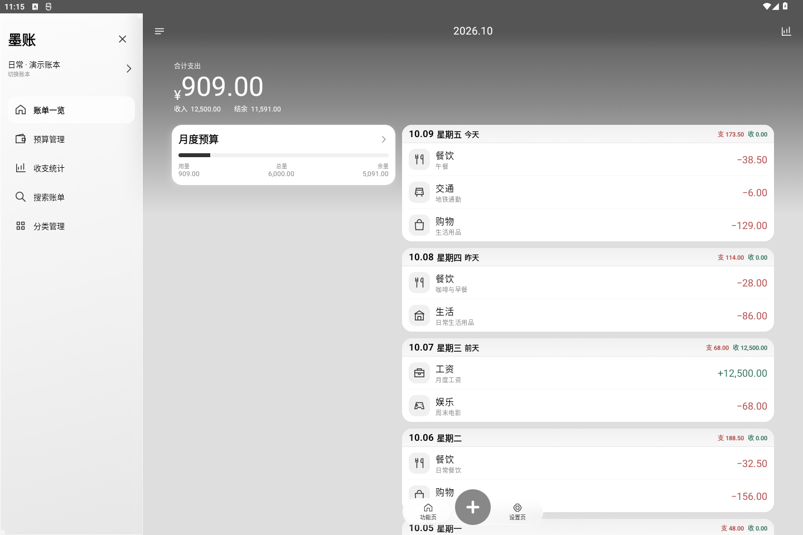
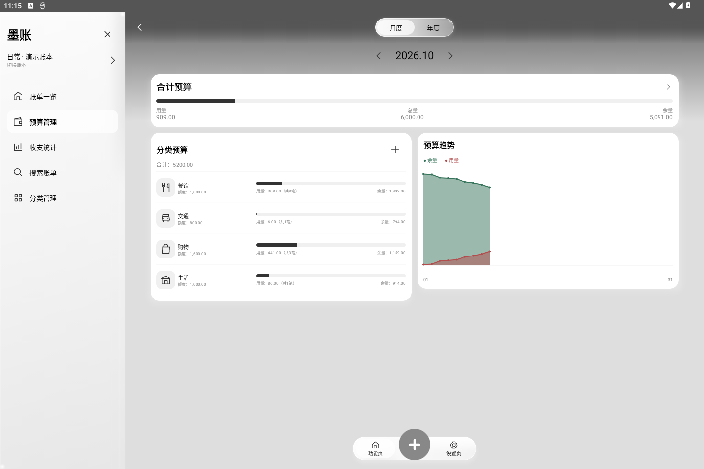

# 墨账 · 原生 Android 迁移版

当前迁移分支采用 **Kotlin + Jetpack Compose + Room + ViewModel / StateFlow / Coroutines**。运行时不使用 WebView、HTML、JavaScript 或远程网页。原生模块在 `native-app/`，Gradle 的 `:app` 指向这个目录。

版本：`0.1.14-native`，versionCode 15，Android 8.0 及以上。优化构建启用 R8 和资源裁剪。包名仍为 `cn.inkledger.app`。

## 保留的功能与视效

- 多账本、分类、收支新增与编辑、按月/年查看、按天分组、分类统计及搜索。
- 月度/年度合计预算、分类预算、累计用量与余量趋势；未设置预算时不绘图。
- 单笔/整天左滑删除、长按编辑/删除/多选、快速修改分类、批量分类与批量移入回收站。
- 移入回收站无需确认；永久删除仍需确认；恢复、完整 JSON 备份导入/导出与演示账本。
- 黑白灰紧凑布局、原有分类线条图标、浮动药丸底栏、三档材质、平板覆盖式侧栏与横竖屏适配。
- 页面模糊与位移、侧栏选中框同步移动、预算卡片展开、整张记账面板由加号圆形展开并原路收回、加号图样过渡、全范围粒子删除。
- 页面与面板动画使用 `cubic-bezier(.16,1,.3,1)` 对应的减速曲线；粒子沿原版的分阶段减速进度运行。

高斯模糊使用 Android 原生 RenderEffect（API 31+）；较低 API 使用透明材质及遮罩降级。原生字体排版与 WebView 栅格不完全相同，未宣称逐像素复刻或已在华为平板满帧验证。

## 数据与升级

金额以整数分存入 Room；显示通过 BigDecimal 格式化为两位小数。数据库操作运行于 IO 调度器；普通修改只更新变更的账单，批量操作与导入使用事务。

首次打开时自动读取原版应用私有目录中的 `ledger.json`，严格校验后导入 Room。先保留 `ledger.webview-backup.json`，原文件不删除；迁移失败不会清空或覆盖旧账本。新的 JSON 导出保持版本 1 结构，可与原版互相导入。

本次交付沿用原有开发签名，因此可以覆盖安装旧版并保留数据。GitHub 不包含签名私钥；其他机器自行构建时会使用当地调试密钥，不能保证覆盖已有安装。正式使用前请从设置导出备份。

## 构建与测试

Android Studio 导入项目，使用 JDK 17+、Android SDK 35、Gradle 8.11.1。

```powershell
.\gradlew.bat :app:assembleRelease
.\gradlew.bat :app:testDebugUnitTest :app:lintDebug
```

Windows 也可执行 `build-local.ps1`；可通过 `-GradleUserHome` 指定独立构建缓存。原有 Java/WebView 独立构建器改名为 `build-webview-legacy.ps1`，原版源代码保留在 `app/`，不编入原生 APK。原版说明见 [WEBVIEW-0.1.13.md](docs/WEBVIEW-0.1.13.md)。

验证包括旧格式往返、回收站保存、金额精度、非法日期/金额/重复标识符/收支分类不匹配拒绝，以及实际 Android 12 模拟器中的导航、编辑、删除、恢复、永久删除确认、多选和多种屏宽。

验证记录见 [native-verification.json](docs/native-verification.json)：10 项单元测试、35 项模拟器检查通过，优化后的正式包另通过新增、分类、删除、恢复、永久删除及旋转状态保留检查。Lint 无错误（11 项依赖更新等提示仍保留）。

模拟器使用软件 GPU，其运行结果不能代表 HUAWEI MatePad Pro 13.2 的实际呈现帧率。当前属于原生迁移预览构建；视效与性能仍需目标设备验收。

## 原生界面截图

截图来自 Android 模拟器运行原生 APK，使用演示账单。

| 手机账单一览 | 手机预算管理 |
| --- | --- |
|  |  |






